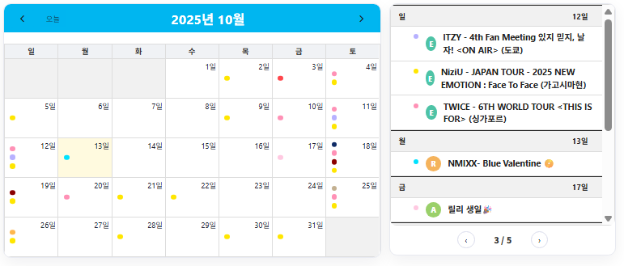
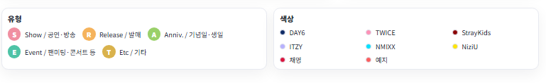

# 🎶 Idol Note

**JYP 아티스트들의 스케줄과 활동 일정을 한눈에 정리하는 팬 플랫폼**

> Idol Note (아이돌 노트)는 JYP 엔터테인먼트 소속 아티스트들의  
> 스케줄, 공연, 앨범 발매 정보를 달력 형태로 정리하고  
> 주간 리스트로 쉽게 확인할 수 있는 웹 사이트입니다.

---

## 🌟 주요 기능

### 📅 스케줄 달력 (`Schedule`)
- **FullCalendar** 기반 월간 / 주간 뷰 제공  
- 그룹 / 멤버 / 앨범 / 공연 데이터를 자동 통합  
- 달력의 점(dot) 색상으로 활동 타입 구분  
- **일정이 없을 때는 ‘일정이 없습니다’** 문구 표시  
- 그룹 색상과 멤버 별 컬러 범례 자동 생성  

### 🧭 주간 이동 (`WeekPager`)
- 한 달 내의 주(week)를 자동 계산하여 이전 / 다음 주로 넘기기  
- 현재 날짜에 맞춰 해당 주를 자동 선택  

### 🎨 색상 및 타입 범례
- 활동 종류별 배지 (S / R / A / E / T) 표시  
- 그룹 및 멤버별 대표 색상 자동 표시  

---

## 🖼 미리보기

| 월간 달력 + 주간 리스트 | 범례 영역 |
|------------------|------------------|
|  |  |

---

## 🛠 기술 스택

| 구분 | 사용 기술 |
|------|------------|
| **Frontend** | React (Vite), FullCalendar, Font Awesome |
| **Style** | CSS Modules (`Schedule.module.css`), Flex + Grid |
| **Data** | JS 기반 데이터 파일 (anniversary, albumlist, performancedate 등) |

---

🌐 배포 주소: [https://idol-note.vercel.app](https://idol-note.vercel.app)